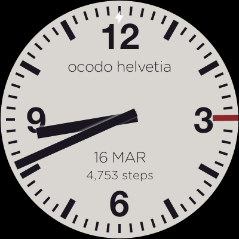
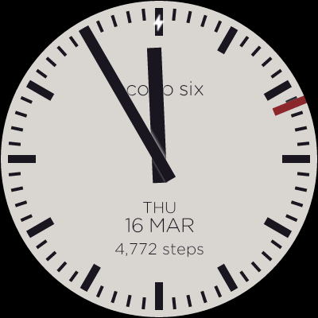

# ocodo watch series one

A collection of watch faces for Android Wear 2.0

They can only be installed from Android Studio (debug build) for now.

Coming to the Play Store when I get around to it :)

## ocodo zero

## ocodo one

## ocodo two

## ocodo three

The following are inspired by Mondaine / CFF (Swiss Railway Clocks)

## ocodo four

## ocodo five

## ocodo helvetia

## ocodo six

